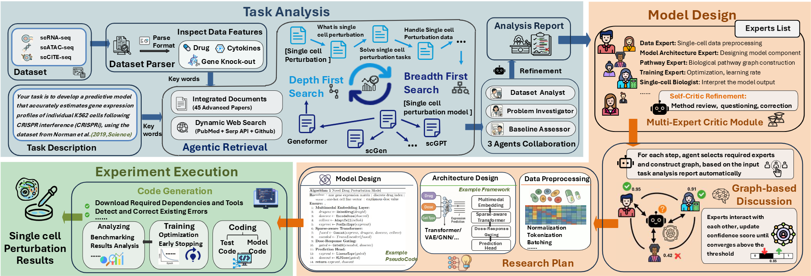

# BioForge: Open-Ended Autonomous Design of Computational Methods for Single-Cell Omics via Multi-Agent Collaboration

[](https://www.python.org/downloads/)
[](https://opensource.org/licenses/MIT)


## 📋 Table of Contents

- [Overview](#overview)
- [Installation](#installation)
- [Quick Start](#quick-start)
- [Configuration](#configuration)
- [Usage](#usage)
- [Project Structure](#project-structure)
- [Troubleshooting](#troubleshooting)
- [Citation](#citation)
- [License](#license)

## 🎯 Overview

BioForge is a cutting-edge **end-to-end** multi-agent framework that revolutionizes single-cell data analysis through intelligent task decomposition, automated method design, and collaborative problem-solving. The system integrates advanced agentic technique and domain-specific expertise to provide comprehensive solutions for single-cell genomics challenges.



## 🚀 Installation

### ✨ Virtual Environment Setup

Before installation, create and activate a virtual environment:

```bash
# Create virtual environment
conda create -n bioforge python=3.9
conda activate bioforge

# Or using venv (Python built-in)
python -m venv bioforge_env
# On Windows:
bioforge_env\Scripts\activate
# On macOS/Linux:
source bioforge_env/bin/activate
```

### 📦 Quick Installation (Recommended)

```bash
# 1. Clone repository
git clone https://github.com/gersteinlab/scAgents.git
cd BioForge

# 2. Create and activate virtual environment
conda create -n bioforge python=3.9
conda activate bioforge

# 3. Run automated installation
python install.py

# 4. Configure API keys
cp env.example .env
# Edit .env with your API keys

# 5. Verify installation
python start.py
```

### ⚙️ Manual Installation (Alternative)

If automated installation fails, try manual installation:

```bash
# 1. Install minimal dependencies
pip install -r requirements-minimal.txt

# 2. Install BioForge
pip install -e .

# 3. Configure environment
cp env.example .env
# Edit .env with your API keys
```

### 🔑 Prerequisites

- **Python**: 3.8 or higher (3.9 recommended)
- **Memory**: 8GB RAM minimum (16GB+ recommended)
- **Storage**: 10GB free space
- **API Keys**: OpenAI, Anthropic, or other LLM service API key
- **Docker**: For code generation
  
## ⚡ Quick Start

### 1️⃣ Verify Installation

Run the quick start check to ensure everything is properly set up:

```bash
python start.py
```

This will check:
- ✅ BioForge installation
- ✅ Directory structure
- ✅ Environment configuration (.env file)
- ✅ Configuration file
- ✅ Basic functionality
- ✅ Virtual environment status

### 2️⃣ Configure API Keys

**Step 1: Copy the environment template to project root directory:**

```bash
# Make sure you're in the BioForge project root directory
cd /path/to/your/BioForge
cp .env.example .env
```


**Step 2: Add your API keys to the `.env` file:**

```bash
# Example .env file content
# LLM API Keys (at least one required)
OPENAI_API_KEY=your_openai_api_key_here
ANTHROPIC_API_KEY=your_anthropic_api_key_here
DEEPSEEK_API_KEY=your_deepseek_api_key
LLAMA_API_KEY=your_llama_api_key
QWEN_API_KEY=your_qwen_api_key

# Search API Keys (required for RAG functionality)
GITHUB_TOKEN=your_github_token_here
SERPAPI_KEY=your_serpapi_key_here
PUBMED_API_KEY=your_pubmed_api_key_here

# Model Configuration
MODEL_NAME=gpt-4-turbo-preview
TEMPERATURE=0.7
MAX_TOKENS=4096000
```

**API Key Requirements:**

**LLM API Keys (choose at least one):**
- OpenAI 
- Anthropic (Claude)

**Search API Keys:**
- **GitHub Token**: For searching GitHub repositories and code 
- **SerpAPI Key**: For web search functionality
- **PubMedAPI Key**: For web search functionality (optional)
- 

## 3️⃣ Initialize Project

### 🔧 Initialize BioForge

```bash
python main.py --init
```
> **💡 What this does**: Creates a default `config.json` file with standard settings, sets up the basic project structure, and prepares BioForge for first-time use. Run this command if you're starting fresh or if the configuration file is missing.


### 📝 Task Description Configuration

**Where to Modify Task Description:**

The task description is defined in the `BioForge/main.py` file. To customize your analysis task:

1. **Edit the DEFAULT_TASK_DESCRIPTION variable** in `BioForge/main.py` (around line 30):

```python
# Default task description - EDIT THIS VARIABLE TO CUSTOMIZE YOUR TASK
DEFAULT_TASK_DESCRIPTION = """Your task is to develop a predictive model that accurately estimates gene expression profiles of individual K562 cells following CRISPR interference (CRISPRi), using the dataset from Norman et al. (2019, Science).

Task Definition:
- Input: Baseline gene expression profile of an unperturbed K562 cell and the identity of the target gene(s) for perturbation
- Output: Predicted gene expression profile after perturbation

Evaluation Scenarios:
1. Unseen Perturbations: Predict effects of gene perturbations not present during training
2. Unseen Cell Contexts: Predict responses in cells with gene expression profiles not observed during training

Evaluation Metrics:
- Mean Squared Error (MSE): Measures the average squared difference between predicted and observed gene expression.
- Pearson Correlation Coefficient (PCC): Quantifies linear correlation between predicted and observed profiles.
- R² (Coefficient of Determination): Represents the proportion of variance in the observed gene expression that can be explained by the predicted values.
- MSE for Differentially Expressed (DE) Genes (MSE_DE): Same as MSE but computed specifically for genes identified as differentially expressed.
- PCC for Differentially Expressed (DE) Genes (PCC_DE): Same as PCC but computed specifically for genes identified as differentially expressed.
- R² for Differentially Expressed (DE) Genes (R2_DE): Same as R² but computed specifically for genes identified as differentially expressed."""
```

2. **Or create a custom config file** (`my_config.json`):

```json
{
  "task_description": "Your custom task description here...",
  "dataset_path": "BioForge/data/datasets/",
  "output_dir": "results/",
  "llm_config": {
    "provider": "openai",
    "model": "gpt-4-turbo-preview",
    "api_key": "loaded_from_env"
  },
  "workflow_phases": ["task_analysis", "method_design", "code_generation"]
}
```

🧬 **Task Description Template:**

```python
DEFAULT_TASK_DESCRIPTION = """Your task is to [TASK_GOAL] using [DATASET_NAME].

Task Definition:
- Input: [DESCRIBE_INPUT_DATA]
- Output: [DESCRIBE_EXPECTED_OUTPUT]

Evaluation Scenarios:
1. [SCENARIO_1]: [DESCRIPTION]
2. [SCENARIO_2]: [DESCRIPTION]

Evaluation Metrics:
- [METRIC_1]: [DESCRIPTION]
- [METRIC_2]: [DESCRIPTION]
- [METRIC_3]: [DESCRIPTION]"""
```

### 📁 Dataset Configuration

**Where to Place Your Datasets:**

1. **Dataset root filepath shuold be**: `BioForge/data/datasets/`

2. **Supported Dataset Formats**:
   You can download Datasets from [scPerturb](https://projects.sanderlab.org/scperturb/)** (recommended) or using other `.h5ad` (AnnData format) datasets.

4. **Dataset Directory Structure**:
```
BioForge/data/datasets/
├── your_dataset_1.h5ad
└── subfolder/ # eg scATAC-seq dataset folder downloded from scPerturb
    └── nested_dataset.h5ad
    └── nested_dataset.csv
    └── ...
```

### 🔄 Workflow Phases

**Complete End-to-End Workflow**:
```bash
python main.py
```

**Individual Phases**:

If you want to execute individual phases, run following instructions separately:
```bash
# Phase 1: Task Analysis
python main.py --phase task_analysis

# Phase 2: Method Design  
python main.py --phase method_design

# Phase 3: Code Generation
python main.py --phase code_generation
```

**Phase Descriptions**:
- **Task Analysis**: Understands and decomposes your analysis task
- **Method Design**: Designs optimal computational methods using multi-agent collaboration
- **Code Generation**: Generates production-ready code for your analysis pipeline


## 🔍 Troubleshooting


### 💻 Command Line Interface

**Complete Workflow**:
```bash
python main.py
```

**With Custom Config (optional)**:
```bash
python main.py --config my_config.json
```

**Initialize Project**:
```bash
python main.py --init
```

**Verify Setup**:
```bash
python start.py
```

### Common Issues

**1. Virtual Environment Issues**
```bash
# Check if virtual environment is activated
which python  # Should show path to your venv
echo $VIRTUAL_ENV  # Should show venv path

# If not activated, activate it:
# For conda:
conda activate bioforge
# For venv:
source venv/bin/activate  # Linux/Mac
venv\Scripts\activate     # Windows
```

**2. Import Errors**
```bash
# Ensure you're in the correct directory and venv is activated
cd BioForge
conda activate bioforge  # or source venv/bin/activate
pip install -e .
```

**3. API Key Issues**
```bash
# Check your .env file
cat .env | grep API_KEY
```

**4. Missing Dependencies**
```bash
# Reinstall dependencies in your virtual environment
conda activate bioforge  # or source venv/bin/activate
pip install -r requirements.txt
```

**5. Dataset Path Issues**
```bash
# Check dataset directory structure
ls -la BioForge/data/datasets/
```

**6. Environment Configuration**
```bash
# Verify .env file exists and is configured
python start.py

# Test PubMed API specifically
python test_pubmed.py
```

**7. Qdrant Connection Issues**
```bash
# Start Qdrant if not running
docker run -p 6333:6333 qdrant/qdrant

# Check if Qdrant is accessible
curl http://localhost:6333/collections
```

**8. Docker Issues**
```bash
# Check if Docker is running
docker --version
docker ps

# If Docker is not running, start it:
# On Windows/Mac: Start Docker Desktop
# On Linux: sudo systemctl start docker
```

## 📚 Citation

If you use BioForge in your research, please cite:

```bibtex
@article{bioForge2024,
    title = {BioForge: Open-Ended Autonomous Design of Computational Methods for Single-Cell Omics via Multi-Agent Collaboration},
    author = {Tang, Xiangru and Yu, Zhuoyun and Chen, Jiapeng and Cui, Yan and Shao, Daniel and Wu, Fang and Wang, Weixu and Huang, Zhi and Cohan, Arman and Krishnaswamy, Smita and Gerstein, Mark},
    year = {2024},
    journal = {arXiv preprint}
}
```

**For datasets from scPerturb:**
```bibtex
@article{Peidli2024scperturb,
    title={scPerturb: harmonized single-cell perturbation data},
    author={Peidli, Stefan and Green, Tessa D. and Shen, Ciyue and Gross, Torsten and Min, Joseph and others},
    journal={Nature Methods},
    volume={21},
    number={3},
    pages={531--540},
    year={2024},
    doi={10.1038/s41592-023-02144-y},
    url={https://www.nature.com/articles/s41592-023-02144-y}
}
```

## 📄 License

This project is licensed under the MIT License - see the [LICENSE](LICENSE) file for details.
